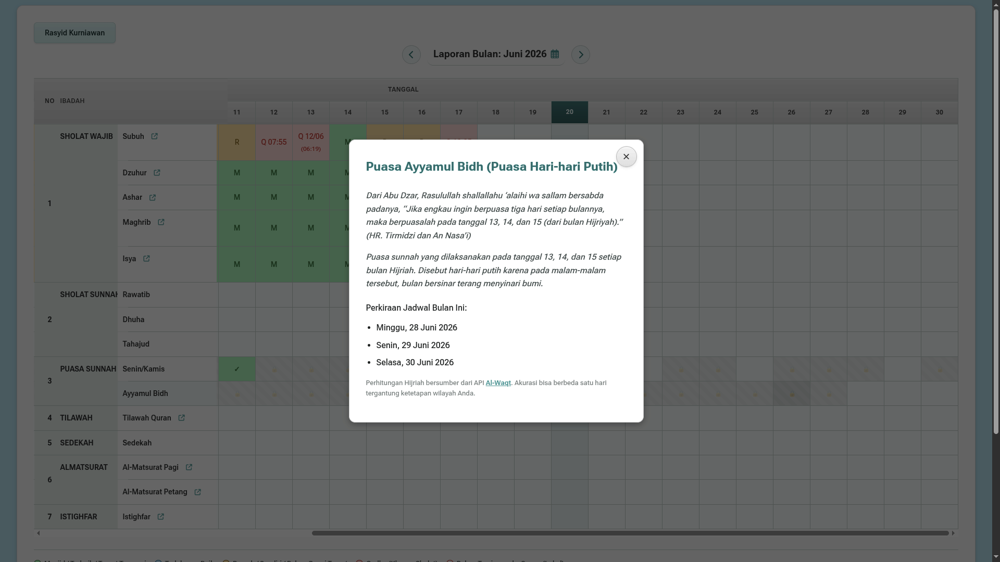

# amalanyaumiyah.xo.je

## command git ftp push
```pwsh
git ftp push
```

## jangan lupa commit dulu sebelum push
```pwsh
git add .
git commit -m "update"
```

## Install PHP
```pwsh
# Download and install PHP.
powershell -c "& ([ScriptBlock]::Create((irm 'https://www.php.net/include/download-instructions/windows.ps1'))) -Version 8.5"
```

## Run PHP
```pwsh
php -S localhost:8000
http://localhost:8000
```

## Cek php error
```pwsh
php -l index.php
```

## Catatan

### Completed
- Pecah kode menggunakan Riverpod style (Modular ES Modules).
- Pecah kode berdasarkan fungsi, satu kode satu fungsi.
- Hapus file/kode yang tidak digunakan (`test/prayer_slider_handler.php`, `test/test_run.php`).

### Cancelled
buat layout penginputan lebih nyaman dengan membuat semuanya muat disatu layar, relayout, bagian penginputan data saya yang dibuat begitu
